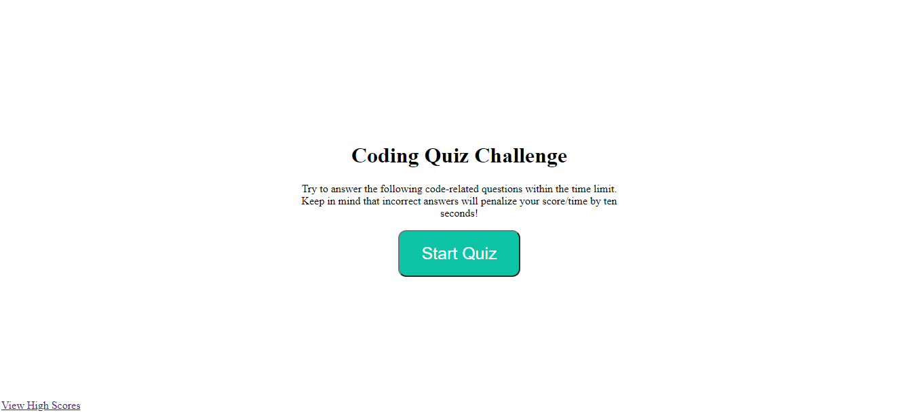
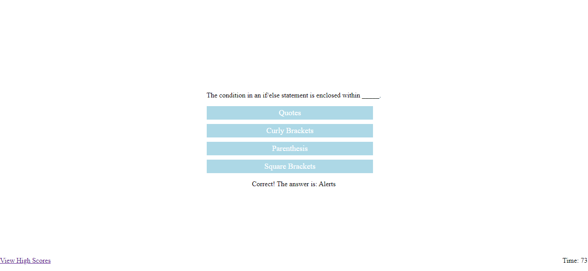
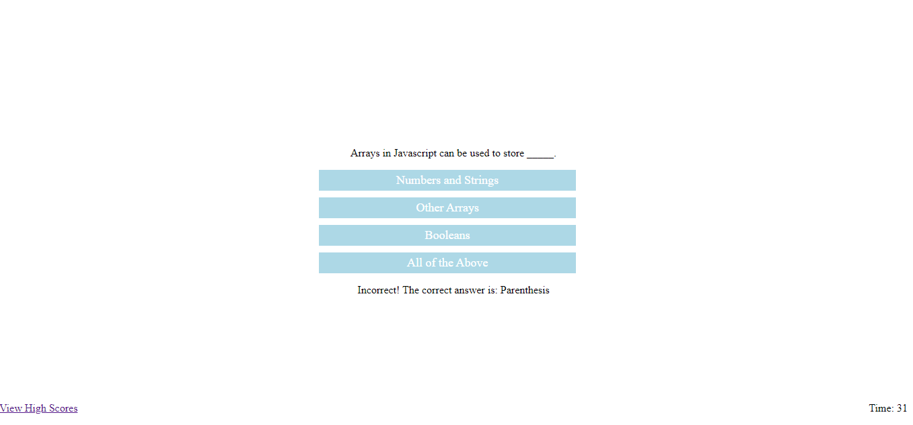

## Challenge 4 - Quiz Game

## Purpose

Create a timed quiz on JavaScript fundamentals that stores high scores

## Task
In Challenge 4 the task was to create a quiz with the following requirements:
- Clicking on the start button will present a question.
- Answering a question will be presented with another question.
- There is a timer that subtracts time based on wrong answers.
- Game is over when the timer hits 0.
- After the game, users can save their highscores.

## Screenshots
Initial Page

Questions (Correct Answer)

Questions (Wrong Answer)

End Game

High Scores

## URL
https://thomasnguyen546.github.io/Quiz-Game/